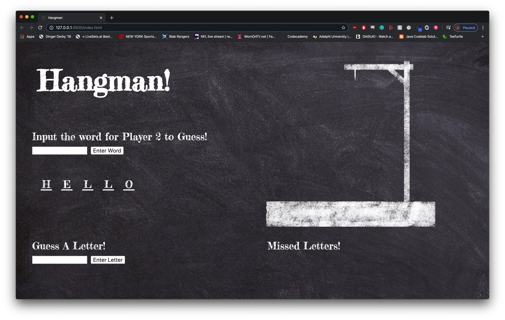

# Hangman

Project 1 for GA

To Play Click [This](https://juicester.github.io/hangman/)

## Technologies Used

- Github
- Visual Studio
- Adobe Photoshop for Chalk textures

## Additional Resources

[Background Image](https://pixabay.com/photos/black-board-chalk-traces-school-1072366)

[isLetter Function](https://stackoverflow.com/questions/9862761/how-to-check-if-character-is-a-letter-in-javascript)

## Add-ons For the Future

I would like to add the following functionality:

- Add on Key Enter
- Add alt's to images and font
- Add Style on Alert box, or a different form of alert
- Add a wrapper on strings that are above 9 characters
- Add a media query for phones
- Add a random word button
- Find an API that checks if something is a word when entered
